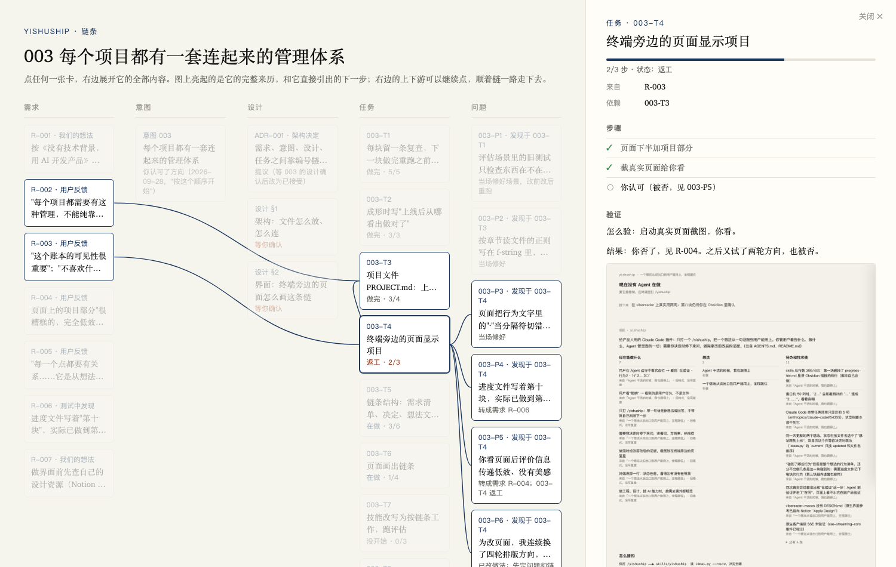

# 003 设计

服务：意图 003
依据：`docs/project-system.md`（调研九个来源）；架构决定见 ADR-001

## §1 架构：文件怎么放、怎么连

```
.ship/
  PROJECT.md      项目是什么、现在能做什么、链条总览
  需求.md         所有需求，带来源和去向
  决定/           跨想法的架构决定，一份一个
  003-xxx/
    意图.md  设计.md  任务.md  验证.md  问题.md  证据/
```

每一项都有编号，下游开头写"来自 / 服务"。脚本检查五种断链：意图没有来源；设计没写服务哪个意图，或未经确认；任务说不出来自设计哪一节；问题说不出是哪个任务发现的；任务标了做完，但验证里没有结果。

每条需求一节，固定几项：标题（翻译后的一句话：要解决什么，不是原话）、来源（谁 · 在做什么时 · 渠道）、原话（一字不改，只作证据）、当时看到的（截图或现场）、我们的理解（标明是推断）、怎样算解决、去向。

没选的：一个文件分区、外部工具、纯 JSON。理由见 ADR-001。需求写成表格一行：装不下截图和理解，只能塞原话，你看不懂（2026-09-28 你指出）。

你确认了：2026-09-28

## §2 界面：终端旁边的页面怎么画这条链

样式沿用你认可的 Kami 方向：纸色底、宋体标题、一种墨蓝强调。每个想法一行，从左到右是 来源 → 意图 → 设计 → 任务 → 验证 → 问题；每个节点标状态，点开能看到它的上下游。

点任何一张卡，右侧展开它的全部内容：需求有原话、来源、去向；任务有进度条（由步骤勾选数算出）、步骤、来自、依赖、验证和截图；每张卡的上游和下游都能继续点。图上只亮选中卡的完整来历和它直接引出的下一步。

你定的（2026-09-28）：
- 一个项目有多个想法时，顶部切换想法，一次看一条链；需求列显示全部需求，没进这个想法的变淡。
- 排期只记先后顺序和依赖，不写日期。
- 等你确认的设计，在它的详情最上面放"可以，照这个做"和"要改"：点"可以"记下确认日期；点"要改"记下你写的意见（R-008）。
- 终端旁边的页面分两页："现在"（Agent 在做什么、有没有等你）和"链条"（这张图）；正在做的任务在链条里也标出来。



没选的：六版灰阶工具风格（你评价"越来越烂"，见 证据/t4-六版工具风格.png）；把项目信息堆成三列列表（"完全低效的信息传递"，见 证据/t4-页面项目部分.png）。

你确认了：2026-09-28
