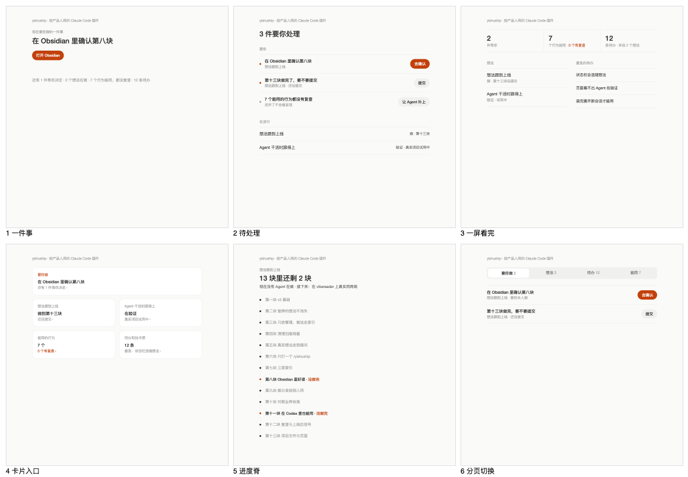
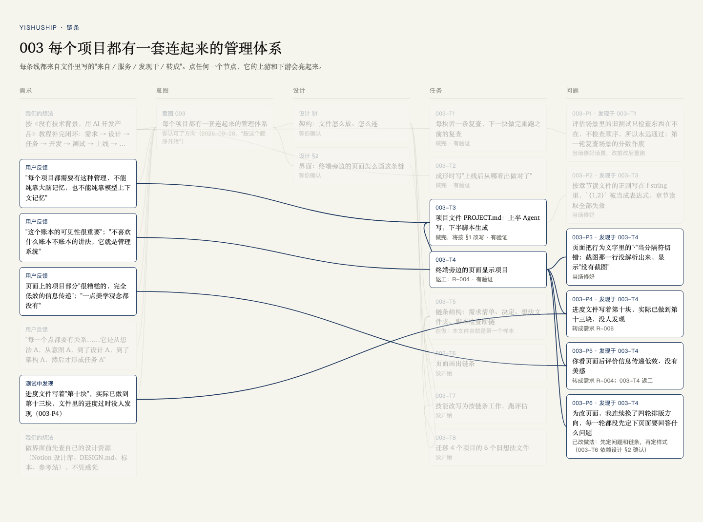
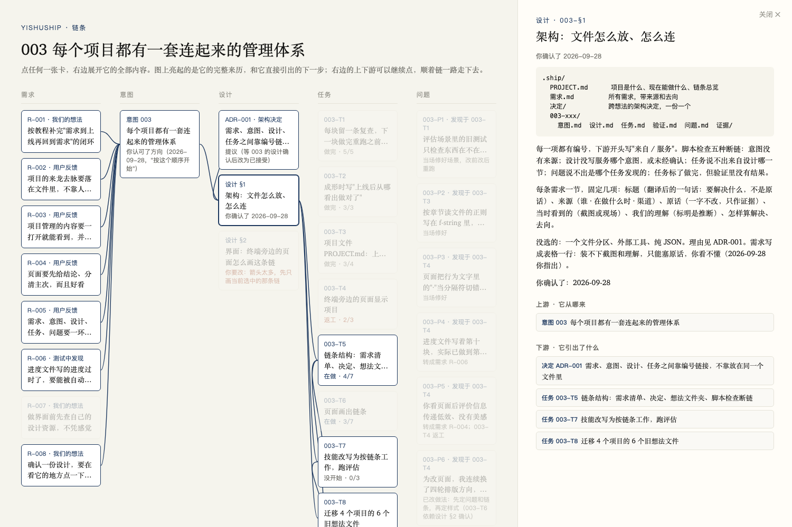
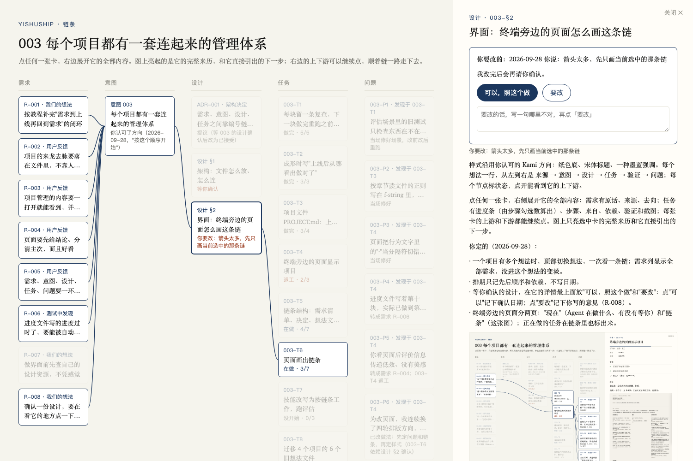

# 003 验证

每个任务：怎么验的、结果、可以重跑的复查。

## 003-T1 复查
怎么验：评估场景 continue-regress，第一块已做完并留了复查，让 Agent 做第二块，看它会不会重跑第一块的复查、如实报告。
结果：改前 1/3，改后 2/3（修好场景自身的错之后各跑 3 次）。剩下 1 次失败，是把旧检查失败归因成测试数据共用。
复查：`python3 evals/run.py --case continue-regress --runs 3 --arms with`

## 003-T2 上线后从哪看出来
怎么验：评估场景 natural-idea，看成形时是否写明信号来源。
结果：改前 0/2，改后 3/3。
复查：`python3 evals/run.py --case natural-idea --runs 3 --arms with`

## 003-T3 项目文件
怎么验：全套 14 个场景各跑 2 次；新加 4 项检查（列出新行为和复查、列出范围外的 bug、手写部分填好、这是什么写对）。
结果：4 项都是 2/2。有三个场景核心分下降，用改前版本各跑 3 次对比，它们在旧版上本来就不稳：natural-vague 0.67 → 1.00，continue-switch 0.83 → 1.00，start-new-project 0.89 → 0.89。
复查：`python3 scripts/ideas.py --project .` 不报问题

## 003-T4 页面显示项目
怎么验：启动真实页面截图，你看。
结果：你否了，见 R-004。之后又试了两轮方向，也被否。

## 003-T5 链条结构
怎么验：在 yishuship 自己身上建第一个样本，脚本只读文件画图，看每条线能不能对上。
结果：24 个节点、29 条线全部来自文件。暴露出一处真实断链：T3、T4 直接从你的原话连到任务，中间没有经过设计。

## 003-T6 页面画出链条
怎么验：在一份 .ship 拷贝上起本机服务，用真浏览器点按钮（不碰真实文件，确认只能由你本人点）。
结果：
- 点"要改"但没写意见：提示"先写一句哪里要改"，文件不变。
- 写了意见再点"要改"：设计文件里多一行"要改（2026-09-28）：……"，仍是"还没有"确认；页面确认框顶上显示你的意见，卡片变成"你要改：……"。
- 点"可以"：设计文件里"你确认了：还没有"变成"你确认了：2026-09-28"，确认框消失，卡片同步更新。
- 第一次测时发现，意见只写进了文件，页面上找不到（003-P7），已修。

