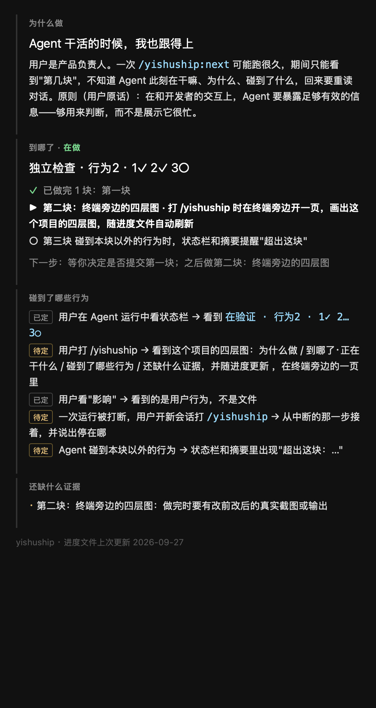
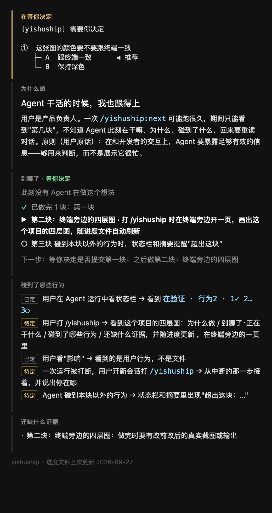
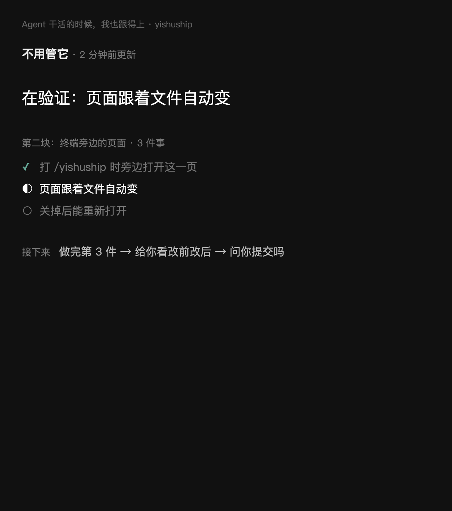
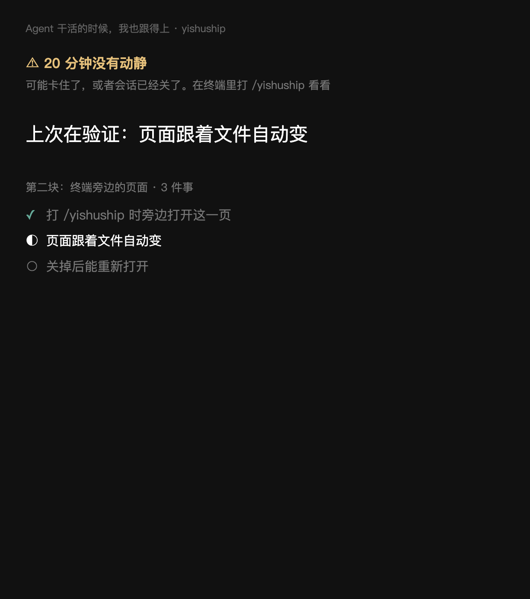
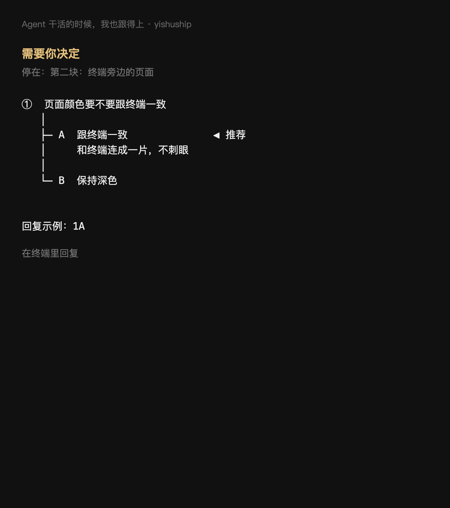
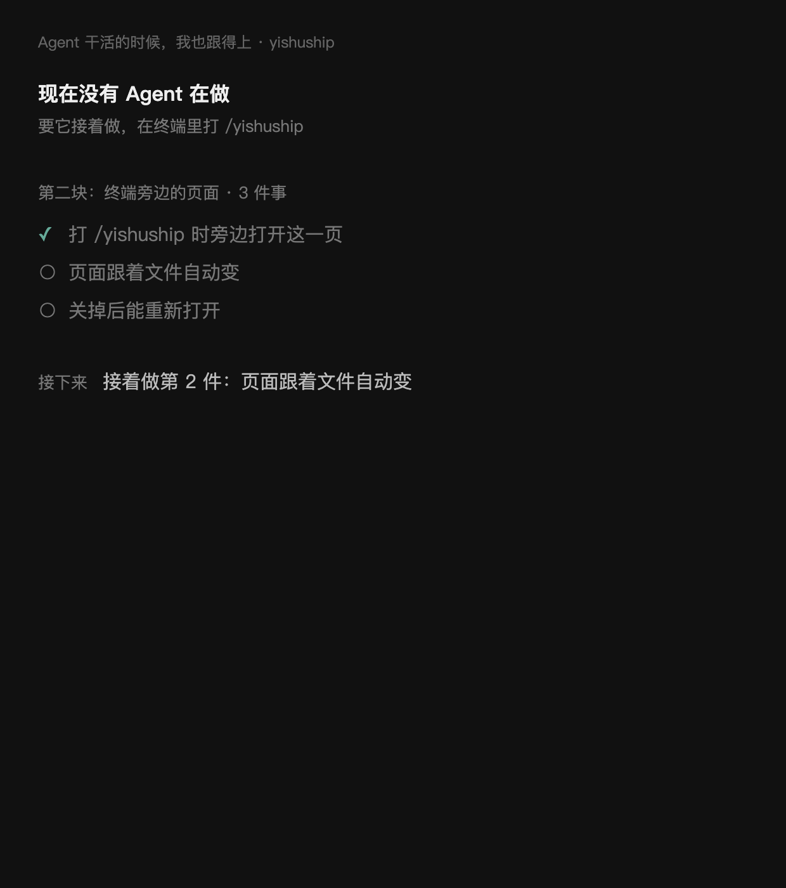

<!-- 走到哪了：由 ideas.py --refresh 生成，不要手改 -->
> [!NOTE]
> **走到哪了 · ● 在做**
> 第二块：终端旁边的页面
> 下一步：在真实项目上用几天，再决定做不做第三块（超出范围时提醒）
> 上次更新：2026-09-27
<!-- /走到哪了 -->

## 等你决定
无

## 进度
- [x] 第一块 状态栏显示此刻在做哪一步、为了哪条行为；超过 15 分钟没更新就标出多久前 · `bf1ef4d`；eval 3/3 次都在换步骤时更新并在结束时清空
- [x] 第二块 打 /yishuship 时在终端旁边开一页，回答要不要你、在干嘛、接下来 · 第一版被否，重做版通过；两次真实会话验证
- [ ] 第三块 碰到本块以外的行为时，状态栏和摘要提醒"超出这块"

## 决定
| 日期 | 定了什么 | 为什么 |
|---|---|---|
| 2026-09-27 | 作为新想法推进，用 yishuship 自己做 | 用户选 1A：先把问题落成可验证的行为，再动代码 |
| 2026-09-27 | "影响"用"碰到了哪几条用户行为"表达，不列文件 | 用户选 2A：用户只判断用户看到的东西，文件列表不会看 |
| 2026-09-27 | 不另做可视化应用，复用状态栏、进度文件、证据页 | 已有的三个位置够用；新界面会多一个要维护、要打开的东西 |
| 2026-09-27 | 做，先做第一块：状态栏显示此刻在哪一步、为了哪条行为 | 用户选 1A |
| 2026-09-27 | 状态栏用固定步骤 + 行为进度，不用自由描述 | 用户选 2A：短、稳定，窄窗口不被截断 |
| 2026-09-27 | 预算三块以内，约一天；到了停下来问 | 用户选 3A |
| 2026-09-27 | 第二块改为：打 /yishuship 时画出项目的四层图并持续更新 | 用户提出：启动时就针对这个项目画图、持续追踪 |
| 2026-09-27 | 四层图放在终端旁边开的一页，自动刷新 | 用户选 1A：一次看全四层，不用自己去开文件 |
| 2026-09-27 | eval 不单独先跑基线，第一块做完后改前改后一起跑 | 用户选 2B；基线可用改动前的提交来跑 |
| 2026-09-27 | `now` 超过 15 分钟没更新时，状态栏在状态部分标出多久前 | 被中断的运行会留下过期的 `now`；放在状态部分，窄窗口也不会被截掉 |
| 2026-09-27 | eval 只跑改后 3 次，和上次完整结果对比 | 用户选 1A：改之前没有这一行，基线必然是 0 |
| 2026-09-27 | "碰到了哪些行为"标"已定 / 待定"，不用 ✓ | 进度文件里勾上的意思是"定了"，不是"做好了"；绿色 ✓ 会被读成做完 |
| 2026-09-27 | "还缺什么证据"只看当前这一块 | 早期块的证据写法不统一，全列出来会一片误报 |
| 2026-09-27 | eval 运行时不开页面 | eval 会替用户打 /yishuship，不能在用户的终端里开分屏 |
| 2026-09-27 | 第二块第一版不通过 | 用户看截图：把进度文件原样搬上页面，没有一句是答案，反而更难看懂；验收只查了会不会更新，没用"5 秒答出"去看截图 |
| 2026-09-27 | 页面按三个问题重做：要不要我、在干嘛为了什么、接下来；平时安静，只有异常亮起 | 用户选 1A；依据态势感知设计、暗驾驶舱、Live Activities 等调研 |
| 2026-09-27 | now 改成用词写（`<步骤> · <这块的哪件事>`），这一块的几件事缩进列在进度里 | 编号要用户自己去对，属于原始数据 |
| 2026-09-27 | 验收加一条：截图给不了解情况的 Agent 看 5 秒，答三个问题 | 第一版只测了机制；旧版在这项测试里得出"不用管"的错误结论 |
| 2026-09-27 | 重做版通过 | 用户选 1A |
| 2026-09-27 | now 里的"哪件事"必须从这一块的清单原样照抄 | 真实会话里 Agent 换了说法，页面和状态栏对不上是哪一件 |
| 2026-09-27 | 第三块先不做，先在真实项目上用几天 | 用户选 2A：先看这一页日常是否真有用 |

## 为什么做
用户是产品负责人。一次 `/yishuship:next` 可能跑很久，期间只能看到"第几块"，不知道 Agent 此刻在干嘛、为什么、碰到了什么，回来要重读对话。原则（用户原话）：在和开发者的交互上，Agent 要暴露足够有效的信息——够用来判断，而不是展示它很忙。

## 怎样算做对了
Agent 运行中或中断后，开一个新会话，只看状态栏和进度文件，5 秒内答得出：为什么做、到哪了、正在干什么、碰到了哪些行为、还缺什么证据。上线一周后回头看：用户是否不再需要翻对话来找回进度。

## 这次不做
- 独立的可视化应用或看板
- 代码依赖图、实时 diff、终端日志、Agent 推理过程、工具调用次数
- 多 Agent / 多会话的并行视图
- 用 hook 从工具调用自动推断步骤（模型不可靠时的退路，另开想法）
- 替换 Claude Code 自带的任务清单

## 最危险的假设
模型真的会在每换一步时更新 `now`；不更新的话，状态栏显示的是过期信息，比不显示更糟。 · 怎么验证：第一块加一条规则后跑 `continue-build` 这个 eval，数 `now` 在一次运行里被改了几次、最后是否和实际一致。这就是第一块本身，没有比它更便宜的检查。

## 用户能看到的行为
- [x] 用户在 Agent 运行中看状态栏 → 看到 `在验证 · 行为2 · 1✓ 2… 3○`
- [ ] 用户打 /yishuship → 看到这个项目的四层图：为什么做 / 到哪了·正在干什么 / 碰到了哪些行为 / 还缺什么证据，并随进度更新 ，在终端旁边的一页里
- [x] 用户看"影响" → 看到的是用户行为，不是文件
- [ ] 一次运行被打断，用户开新会话打 `/yishuship` → 从中断的那一步接着，并说出停在哪
- [ ] Agent 碰到本块以外的行为 → 状态栏和摘要里出现"超出这块：…"

## 证据
### 第一块 状态栏显示此刻
状态栏的真实输出（示例项目 demo，去掉颜色）：
```
改之前  ● 在做  demo · 登录白屏  第一块：登录后直接进首页
改之后  ● 在做  demo · 登录白屏  在验证 · 行为2 · 1✓ 2… 3○
过期时  ● 在做 · 3 小时前  demo · 登录白屏  在验证 · 行为2 · 1✓ 2… 3○
窄窗口  ● 在做 · 3 小时前  demo · …
上线中  ● 准备上线  demo · 登录白屏  在验证 · 行为1 · 1… 2○
```
eval（continue-build，3 次，$2.24，结果在 evals/results/20260927-143126）：
- 原有判分项 3 次全过，和上次（20260927-003157）一样是 1.0
- 当前步骤：改之前 0/3 次出现；改之后 3/3 次都更新过并在结束时清空，顺序为 在写→在验证→独立检查（其中一次没写独立检查）
- 这两项是改了判分方式后，用同一批运行记录重新判的：原来只数编辑工具，漏了 Agent 用命令行改的情况
独立核对：新开的 Agent 用自己的示例项目核对了 6 条，全部通过；它发现上线阶段不显示 now，已修。

### 第二块 终端旁边的四层图
改之前：打 /yishuship 时不开任何页面，只有状态栏一行。
改之后（示例项目，真实 cmux 分屏截图）：Agent 在做时 / 在等你决定时


- 改进度文件里的当前步骤，0.6 秒后页面自己变了，没有重新加载
- 文件 40 分钟没改时，当前步骤后面显示"40 分钟前没更新"
- 第二次打开时说"已经开着"，不重复开；关掉 10 秒后再打开会重新开
- 独立核对：新开的 Agent 用自己的示例项目核对 8 条全过；它发现的两个边角（slice 带引号、提问块带语言标记）已修

### 第二块重做





一眼测试（不了解情况的 Agent 看截图答三个问题）："要不要我"一题，旧版答错（以为不用管，其实在等你）；新版四种状态都答对（"没人在做"修过一次）。
真实会话（示例待办项目，打 /yishuship 1A 2A 3A）：页面一开始就在终端旁边打开；Agent 列出这一块 3 件事并全部勾上；当前步骤 在写 → 独立检查 → 清空；但当前那件事的说法和清单对不上，页面标不出是哪件（已改规则）。
复测（改规则后再跑一次）：当前那件事两次都对上清单第 1 件，页面能标出、状态栏显示 1/3。

## 遗留
- skills 总行数 399/400：第一块删掉了 progress-file.md 里讲 Obsidian 链接的两行（脚本自己会做）
- 窗口约 50 列时，"2…" 会和截断补的 "…" 连成 "2……"，看着含糊
- Claude Code 自带任务清单只显示前 5 项（anthropics/claude-code#54355），状态栏脚本读不到它
- 同一天更新的两个想法，状态栏按文件名选中了"想法跟到上线"，没显示这个在等你决定的想法（`ideas.py` 的 `current` 只按 updated 和文件名排序）
- "碰到了哪些行为"目前是整个想法的行为清单，还分不出哪几条是这一块碰到的；需要进度文件记下每块的行为（第三块越界提醒也要用）
- 两次真实会话都没出现"在验证"这一步：Agent 把验证并进了"在写"，页面上看不出它在跑产品验证
