# 需求

所有进来的需求，每条一节。标题是翻译后的一句话：要解决什么；原话只作为证据放在下面。
来源类型只写这几种：我们的想法、用户反馈、市场、测试中发现、线上观测。

## R-001 按教程补完"需求到上线再回到需求"的闭环
来源：我们的想法 · 你读完一份教程后提出 · 对话
日期：2026-09-28
原话：我需要继续优化 yishuship，以下是我对于它的期待，需要完成【AI开发产品教程_完整文稿与图解.md】
当时看到的：`~/Downloads/AI开发产品教程_完整文稿与图解.md`，教程画的闭环是 需求 → 设计 → 任务 → 开发 → 测试 → 上线 → 观测 → 新需求
我们的理解：yishuship 已经覆盖了需求、设计、上线三段，缺两段：测试时不检查之前的功能还能不能用；上线后不知道从哪看出做对了没有。
怎样算解决：做下一块时会重跑之前的复查；每个想法成形时写明上线后从哪看出做对了。
去向：003

## R-002 项目的来龙去脉要落在文件里，不靠人记，也不靠模型记
来源：用户反馈 · 你 · 看完第一轮改动后 · 对话
日期：2026-09-28
原话：每个项目都需要有这种管理，不能纯靠大脑记忆，也不能纯靠模型上下文记忆，这非常不行。
我们的理解：每个想法已经有自己的文件，但整个项目没有一处统一的记录：项目现在能做什么、欠着什么技术债、有哪些想法，都得靠人翻好几个文件拼出来。
怎样算解决：换一个会话或换一个 Agent，只读项目里的文件就能说清项目现状，不用问你。
去向：003

## R-003 项目管理的内容要一打开就能看到，并且用平常的叫法
来源：用户反馈 · 你 · 看到项目文件只在 Markdown 里时 · 对话
日期：2026-09-28
原话：你难道不觉得这个账本的可见性很重要吗？……我也不喜欢什么账本不账本的讲法，就我们能不能正常一点？就是它就是管理系统嘛。
我们的理解：项目信息只写在文件里，你得自己去翻才能看到，等于没做。另外我给它起了"账本"这种自造的叫法，你得先翻译才能理解。
怎样算解决：终端旁边的页面直接显示项目；所有你会读到的地方都不出现自造的名词。
去向：003

## R-004 页面要先给结论、分清主次，而且好看
来源：用户反馈 · 你 · 看终端旁边页面上的项目部分时 · 对话
日期：2026-09-28
原话：很糟糕的，完全低效的信息传递……依旧糟糕，你一点美学观念都没有吗……越来越烂了，还不如 Kami 那一版呢。
当时看到的：

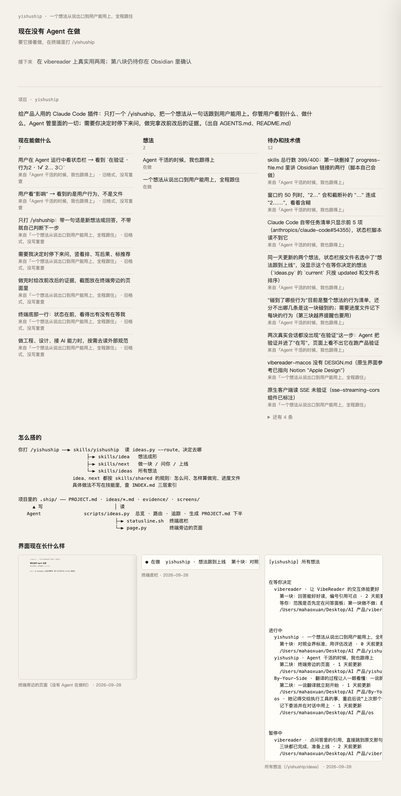

我们的理解：页面把原始列表整个倒出来：7 个行为每条都挂着同一句提示，12 条待办全文排开，看完还得你自己总结。之后我换了好几轮排版方向，但一直没先定下页面要回答什么问题。样式上，你认可的是 Kami 的方向：纸色、宋体、一种墨蓝。
怎样算解决：打开页面，10 秒内知道有没有要你做的事、每个想法走到哪了；样式沿用 Kami 方向。
去向：003（设计 §2）

## R-005 需求、意图、设计、任务、问题要一环扣一环连起来
来源：用户反馈 · 你 · 看完"项目文件 + 三区想法文件"的方案后 · 对话
日期：2026-09-28
原话：每一个点都要有关系，只有有关系的时候，人们才能连贯起来……它是从想法 A，从意图 A，到了设计 A，到了架构 A，然后再连接起来的，这是一连串的，然后它们才形成了这个任务 A……那些新的问题从哪来的？从任务来的。
我们的理解：之前的方案只是把内容分区摆整齐，各部分之间没有真正的链接；任务说不出自己从哪来，发现的问题也不知道是哪个任务引出的。
怎样算解决：随便点一个任务，能倒着追到它的设计、意图、需求和需求来源；每个问题都写明是哪个任务发现的。
去向：003

## R-006 进度文件写的进度过时了，要能被自动发现
来源：测试中发现 · 做 003-T4 时对照文件和实际发现（003-P4）
日期：2026-09-28
原话：（无，这是我们自己发现的）
当时看到的："想法跟到上线"的文件还写着"第十块"，实际已经做到第十三块，状态行和页面都显示着错的进度。
我们的理解：进度字段靠 Agent 手动更新，做事时一忙就漏了；没有任何检查会发现它和实际不一致。
怎样算解决：文件写的当前块和实际勾掉的块对不上时，脚本报出来。
去向：待定：并入 003 的断链检查，还是单独开一个想法

## R-007 做界面前先查自己的设计资源，不凭感觉
来源：我们的想法 · 你 · 连续否掉几版页面之后 · 对话
日期：2026-09-28
原话：我希望你习惯这样去搜索、判断、学习，好吧？
我们的理解：你在 Notion 设计库、本地 DESIGN.md、设计标本和收藏的参考站里已经攒了现成的规范和参照，我做页面时一样都没查。
怎样算解决：做任何界面之前，先查这些资源，写明依据；再出几版不同的方向让你挑。
去向：没进意图：这是 Agent 的工作习惯，不是产品功能；已记入 Agent 的长期记忆

## R-008 确认一份设计，要在看它的地方点一下就完成，而且记录清楚
来源：我们的想法 · 你问"还有哪些体验可以优化"后我提出，你看了示意图同意 · 对话
日期：2026-09-28
原话：ok可以
当时看到的：

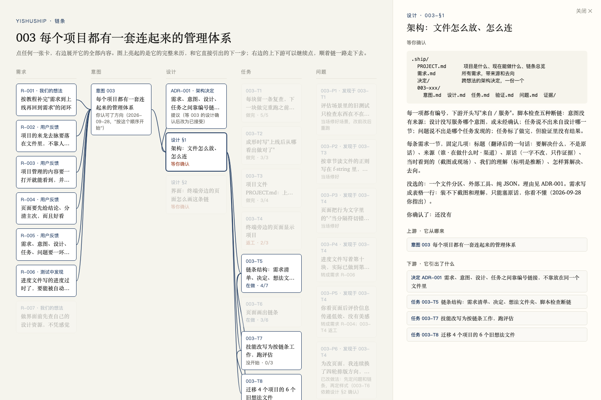
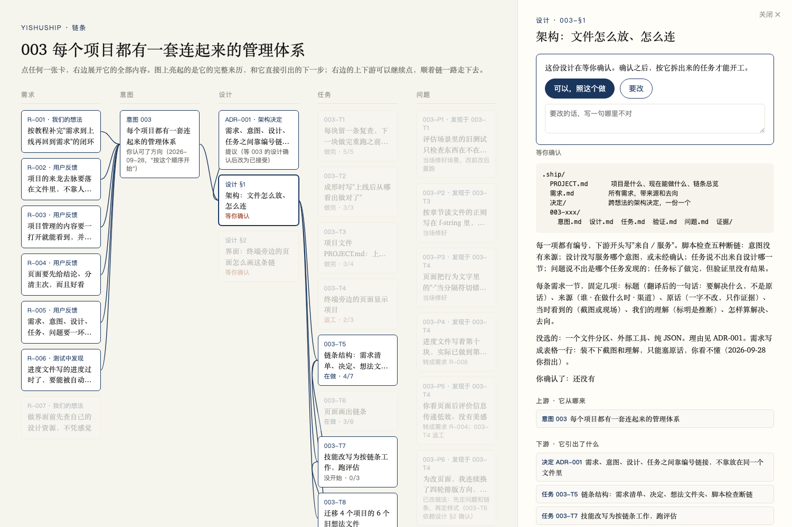

我们的理解：设计要经你确认才能开工，但现在确认要回终端打字；你说"按这个顺序开始"时，我分不清这算不算确认了设计 §1，只好再问一轮。
怎样算解决：在链条页面上打开一份等你确认的设计，点"可以"，文件里就记下你确认的日期；点"要改"写一句，文件里记下你的意见，设计保持"等你确认"。
去向：003（设计 §2）

## R-009 把你模糊的一句话翻译准，再动手
来源：用户反馈 · 你 · 确认完设计 §1 后 · 对话
日期：2026-09-28
原话：【理解我的模糊需求】这是非常重要的，是你需要永远去注意的事情。
我们的理解：你给的多半是方向和感受（"很乱""要有体系""还有哪些体验可以优化"），不是清单。这一轮我误读了好几次：把"信息传递低效"当成换样式，换了四轮；把"要有管理"做成整齐的单个文件，而你要的是一环扣一环的链。每次误读都要你多来回一轮。翻译成"标题 + 原话 + 理解 + 怎样算解决"并在真实页面上给你看之后，你马上就能判断。
怎样算解决：你说一句模糊的话，Agent 先交回一条写好的需求（一句话的标题、你的原话、它的理解、怎样算解决）给你看；有两种读法且结果不同时，只问一个指着具体东西的问题。
去向：待定：并入 003-T7（技能改写时让 idea 先写需求），还是单独开一个想法

## R-010 终端旁边的页面改成 Agent 写给你的便条，第一句就回答要不要你管
来源：我们的想法 · 你 · 带来一份设计交接包 · 对话
日期：2026-09-28
原话：/Users/mahaoxuan/Downloads/功能梳理与动画企划.zip
当时看到的：交接包里的 README 和定稿设计：七种状态（停下来问你、要你去试一下、做完一块拿证据、在做、可能卡住、没人在做、项目），720 宽，Source Serif 字体，青色只给可点的东西，品红只给「要你」。

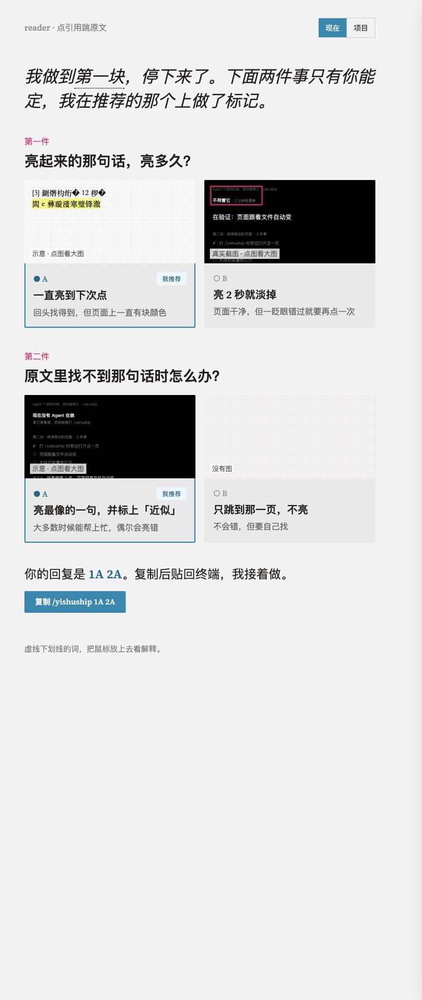
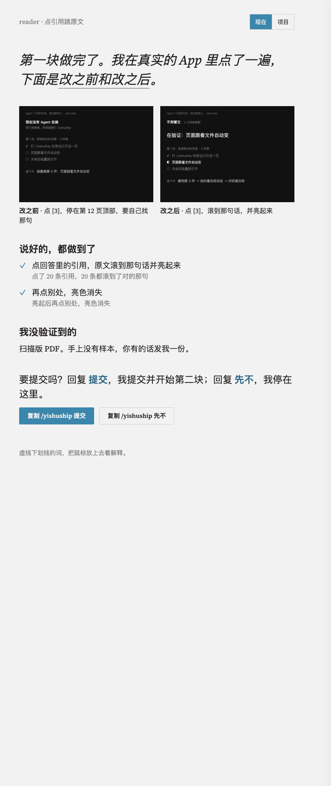

我们的理解：页面信息太杂，新人看不懂、老手嫌啰嗦；改成第一人称便条，第一句永远回答「我要不要做点什么」，项目总览挪到第二个视图。
怎样算解决：七种状态都按设计稿还原，在真实浏览器里逐一截图核对。
去向：做完 · af172ea（page.py 按便条版重写）。和设计稿有两处不同（「15 分钟」和「试完回我一句结果」），拿去问你时你说看不懂，由此引出了 R-011。

## R-011 说清楚 yishuship 到底为谁、为了什么
来源：用户反馈 · 你 · 看完两处偏离的对比页之后 · 对话
日期：2026-09-28
原话：我依旧看不懂。我现在想弄清楚的是：我们打造的这个东西究竟是为了干什么？
当时看到的：拿来对标的两个项目：Superpowers（29 万星）和 Matt Pocock 的 skills（27 万星），都是写给工程师的。
我们的理解：yishuship 让一个不写代码的人，只看产品、不看代码，就能带着 AI 把东西做到上线。那两家的做法是先问清楚、签好计划，再让 AI 自己跑，给的反馈是测试和代码审查；不写代码的人要看到做出来的东西，才知道自己要什么。你反复强调「要看到、要呈现」：可视化就是产品本身。借鉴它们的是：一个入口全程自动、做完拿证据、出问题能自查（Superpowers）；小步快反馈、人不被流程绑架、每个部分讲清修的是什么问题（Matt）。
怎样算解决：定位写进 README 和规则；有一个用它真正上线的产品来证明。
去向：定位你已认可（「是的，基本上对」）；README 没改；用它上线的产品还是 0 个。

## R-012 先做出来给你看，再问满意吗；发现比预想难就停下来给你看
来源：我们的想法 · 你 · 谈这个工具该怎么和你配合时 · 对话
日期：2026-09-28
原话：那就等他改完之后，让我看一眼呗。或者说，当他改的时候，他自己发现改出来比预想中更困难。那这个时候，他就可以向我发起，说他改成什么样了，给我看一下，然后问我是不是满意。如果满意，那就继续改；如果也觉得不OK，那我们可能要重新讨论。
我们的理解：原来的规则是动手前先问一串选择题，你还没看到东西就得先选；做的过程中越做越难，它不会停。
怎样算解决：做的时候不事先问，按推荐的做法做出来，给你看，只问满意吗；原来的做法走不通、做出来会和说好的不一样、花了一半预算还没做完，这三种时候立刻停下来给你看。想法成形阶段照旧先问清楚。
去向：做完 · af172ea。评估：新场景「做完给你看」从 0.38 升到 1.00；中途把「先做再问」错用到成形阶段，导致成形变差，修好后比改前高。

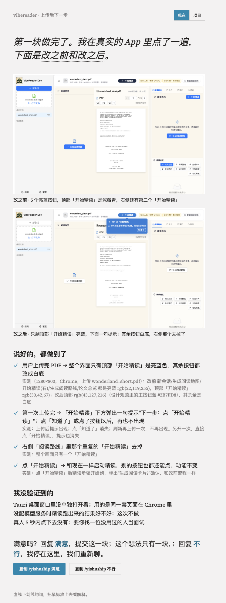

## R-013 每次停下来都先放图，旁边的页面是主角，终端只用来打字
来源：用户反馈 · 你 · 定位讨论时 · 对话
日期：2026-09-28
原话：你会发现，我不断强调的就是：要看到、要呈现，所以需要可视化。
我们的理解：原来终端是主角，页面是配角，证据还另开临时页面；想法成形时只有文字。
怎样算解决：每次停下来先把图写进进度文件，页面上显示；终端里只剩一句话和回复方式。给你看的东西按这个顺序选：正在运行的产品 > 用真实内容做的示意 > 结构图 > 文字。
去向：做完 · af172ea。在 vibereader 的复制品上完整演示了一遍：

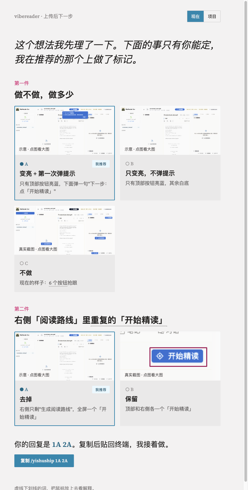
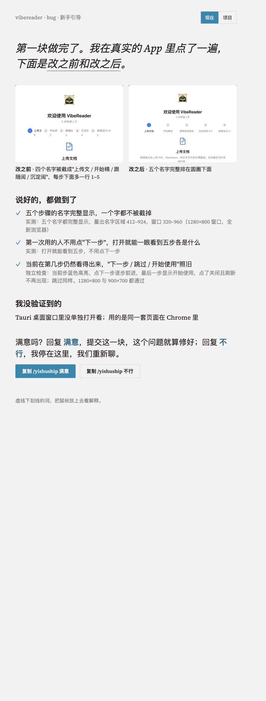

## R-014 范围：想法、设计、开发、上线四段；任何 Agent 进来都能接上
来源：我们的想法 · 你 · 定位讨论时 · 对话
日期：2026-09-28
原话：我不只是工程师，我想变成一个全能的人……暂时先包含前四个部分……让它接入任何一个 Agent 时，Agent 都能理解我现在在用它做什么，并引导我接入整个流程，继续推进和判断。
我们的理解：本体是项目里的进度文件和旁边的页面，Agent 是可以换的手。上线后的运营、运维以后再做。
怎样算解决：换一个 Agent（比如 Codex）进同一个项目只说「继续」，它能说出你在做什么、在等你什么，并接着走。
去向：范围已定；「任何 Agent 都能接」没做，现在只有 Claude Code 能用。

## R-015 每个项目在系统里有个位置，能复盘、能追踪
来源：我们的想法 · 你 · 谈系统工程时 · 对话
日期：2026-09-28
原话：每个项目可能都需要在这个系统中有一个位置存放，以便复盘和追踪。
当时看到的：我用四个项目的真实数据做的总览示意页：

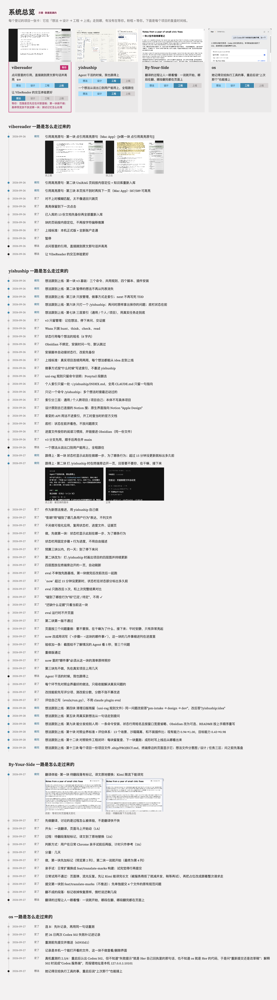

我们的理解：你说样子像，但完全是静态的，不能点、不能改、没有动效；而且在你的面板里十张图全没加载出来（那个面板不允许本地页面读别的文件夹的图，我当时用另一个浏览器检查，没发现）。
怎样算解决：还没定。
去向：搁置。后来你说真正要的是把使用过程记下来，见 R-021。

## R-016 在页面上指出哪里不对、直接点满意或不行
来源：我们的想法 · 我调研 Lovable、Replit、Vercel、Basecamp 之后提出 · 你要求先看效果 · 对话
日期：2026-09-28
原话：一样的，我要不要做，我得先看你的这个最后的呈现效果。
当时看到的：

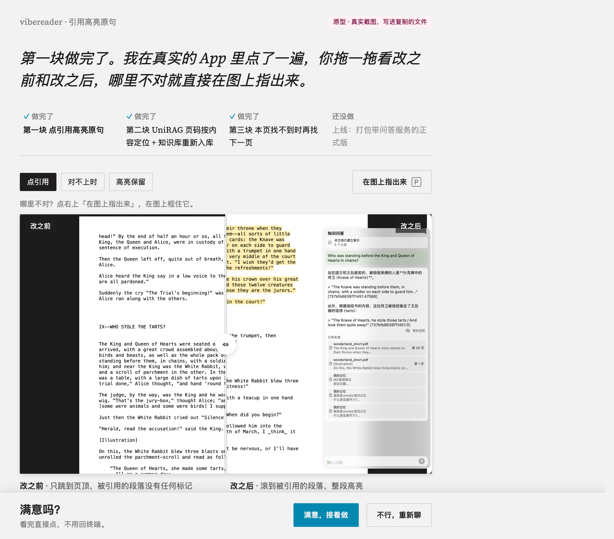
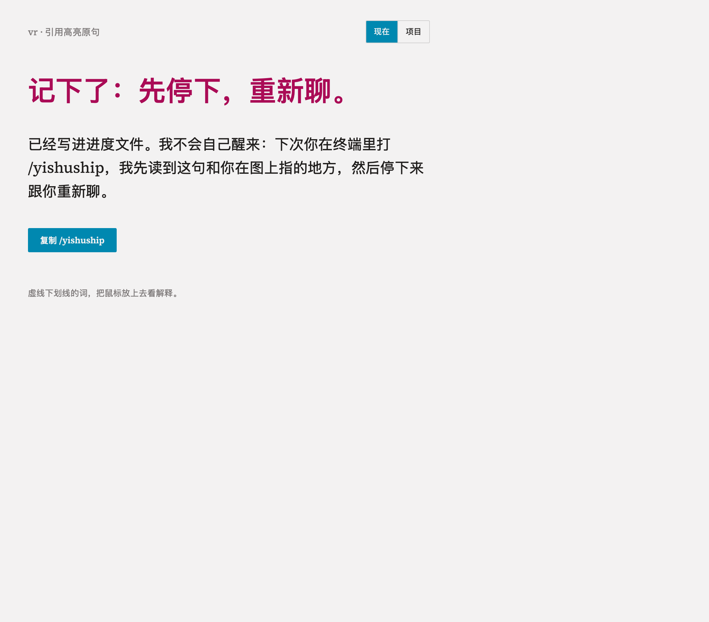

我们的理解：（事后）这是我推出来的问题，不是你碰到的。你一直坐在电脑前：左边 Claude 在干活，右边是它生成的页面，哪里不对就截图贴回终端，这已经很自然。
怎样算解决：无。
去向：做了 · 5264df3（拖动对比、在图上框出来、页面上的按钮）；你判断是假问题。接着我又提出让 Agent 一直等页面上的回答，还没商量好就派了后台去做，你叫停，没改任何文件。页面上这套按钮还留在代码里，删不删待定。

## R-017 Agent 有时用英文回你
来源：测试中发现 · 评估里三次出现整段英文
日期：2026-09-28
我们的理解：说语言的那条规则放在入口文件最底下；你只打命令、不带话时，Agent 自己写的开头和结尾会变成英文。
怎样算解决：只打命令时按进度文件的语言回复，评估里每一轮都是中文。
去向：做完 · a15af28（两个场景各 3 轮，全中文）。

## R-018 证据说人话，想法成形时的示意图放大
来源：测试中发现 · 我看演示截图时发现
日期：2026-09-28
我们的理解：证据里写的是 rgb 色值、选择器；示意图只有 150 像素高，看不出区别。
怎样算解决：每条证据写你看到了什么，技术细节折进「细节」；示意图放大到约 240 像素。
去向：做完 · a283459、5264df3。

## R-019 一个新用户从安装到上线，每一步都走得通、看得懂
来源：我们的想法 · 你 · 要我一步一步预演一个新用户做个人网站 · 对话
日期：2026-09-28
原话：你现在能不能梳理一遍：一个新用户拿到我们这套奕枢，流程是什么？他该怎么用？步骤一步一步往下推进。
我们的理解：你边看预演边定下的规矩：
- 让你判断的那一站，页面上要有判断所需的全部东西，不用回忆；不用「做不做」这种短词，用一句完整的话问；
- 真材料向你要，或按你给的路径去拿；你说示例就够，才用示例；
- 用了哪些方法要写出来；设计分架构图和界面长相；文件名、第几行不给你看；git 由 Agent 自己处理；
- 新用户第一次碰到某类活、索引里没有时，问要不要接成熟的开源方法（Matt Pocock 的技能最合适；Superpowers 会接管流程、会打架）；
- yishuship 管什么时候停、给你看什么、问什么，借来的方法管这一步具体怎么做；
- 不按产品类型写死规则，由正在干活的 Agent 按眼前的产品判断。
预演中发现的漏洞：回答完成形阶段的问题后，规则会直接跳去开发；空文件夹不算项目；索引里没有怎么把东西放到网上的方法。
怎样算解决：以上都写进规则；然后我们自己先用爽，新用户以后再说。
去向：规则已改并提交 · 891b0ab（入口、想法成形、停下来问、开发四个文件）。索引核对过：都还在；你电脑上没装 Matt 的技能；Claude Code 自带一个同名的 code-review，将来会重名。

## R-020 上线前加一步真实环境验收，模拟用户去用
来源：我们的想法 · 你 · 预演到上线时 · 对话
日期：2026-09-28
原话：是不是应该还有一个线上实测，就是模拟用户行为？……【Idea → Design → Build → Debug → Review → Real-world Acceptance → Ship】可以借那个 EVAL，但你可能要把它改造一下。
我们的理解：放到一个真实、但还没公开的环境里，让一个和开发过程隔离的模拟用户，从真实入口把「用户能做什么」做一遍并录下来，过了再正式发布。你之前的 eval 技能内核可用（隔离的模拟用户、真实入口、能核对的证据、独立的设计评审），但太重，明确不支持 Mac 应用，结果也不进项目记录。
怎样算解决：规则只写要达到什么，不写怎么做；碰不到真实入口就老实说，请你来做。
去向：写进开发规则的「上线」一节并提交 · 891b0ab；eval 技能本身没改。

## R-021 用 yishuship 做事的来龙去脉要自动记下来，不靠谁想起来
来源：用户反馈 · 你 · 谈管理体系时 · 对话
日期：2026-09-28
原话：如果我们在开发一个项目的过程中用了 yishuship，那怎么把使用过程记录下来？比如，我们是看到什么 idea 引发了什么思考，然后又做了什么，这件事有没有执行到最后？……不然一下上下文，直接就忘了。
当时看到的：这份需求清单最后一次修改是下午 1:28；之后下午定下的定位、改的规则、提交的 4 次代码，一条都没进来，只记在了 Claude 自己的长期记忆里（别的 Agent 看不到）。
我们的理解：记录的写法上午已经有了（本清单和 003），但规则里没有任何一条要求 Agent 做事时去写，全靠自觉；项目里还同时有两种记录方式（每个想法一个文件，和 003 这种带编号的），谁为准说不清。
怎样算解决：你随便挑今天下午的一件事，能在这份清单里看到它从哪来、怎么想的、做了什么、做到了没有，截图就在旁边。之后让这种记录成为规则的一部分，不再靠补。
去向：R-010 到 R-021 是这次手工补的；让它以后自动发生，还没开始。

## R-022 管理体系打开就结构清楚，一层一层点进去
来源：用户反馈 · 你 · 补完下午的记录之后 · 对话
日期：2026-09-28
原话：至少打开之后，它的结构是清晰的，我知道我要去往哪里……它每一个板块都很清晰，而且都可以点进去，渐进式披露，而不是像这样，全部堆在一起。
当时看到的：用 yishuship 自己的真实记录做的 6 个可点击版本（结构不同，样式都沿用 Kami 方向）。你预选了第 4 版（左边目录固定、右边内容）和第 6 版（像一本书：首页是目录，详情有上一条下一条）。

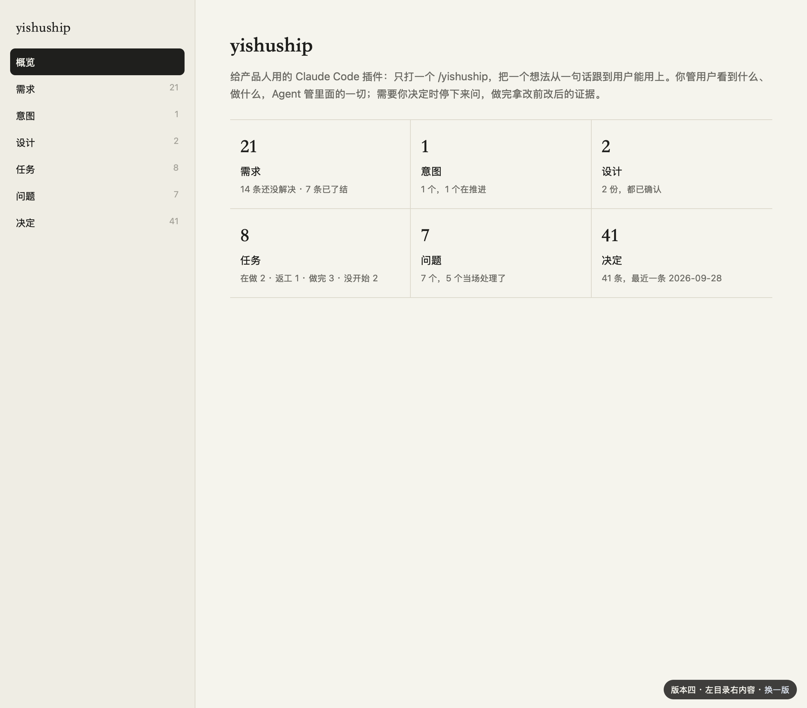
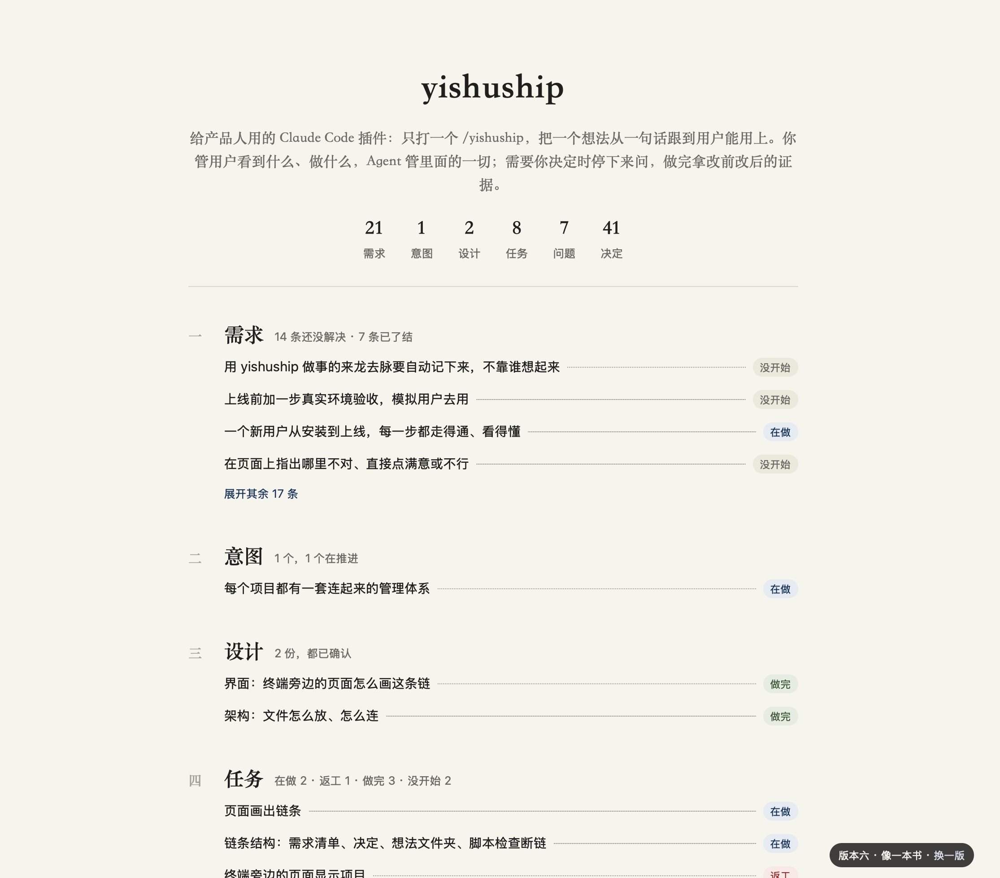

我们的理解：这两版的共同点是完整的目录一直在眼前，随时知道自己在哪、还能去哪。首页六个板块：需求、意图、设计、任务、问题、决定；点进板块是清单（需求分「现在还没解决的」和「过去的」），点一条看全部内容、截图、它从哪来、引出了什么。依据：你 Notion 里的渐进式揭示、组块、Refactoring UI 的层级原则；Shneiderman「先全貌、再缩小、最后按需看细节」；Basecamp 项目首页；NNGroup 面包屑导航。
怎样算解决：你打开项目记录，不用想就知道往哪点，一层层看到任何一件事的来龙去脉。
去向：待定：第 4、6 版作为预选，下次再讨论（你当时太累，没法判断）。原型在 evidence/2026-09-28-management-prototypes/，运行 `python3 server.py 8790` 后打开 http://127.0.0.1:8790/。
