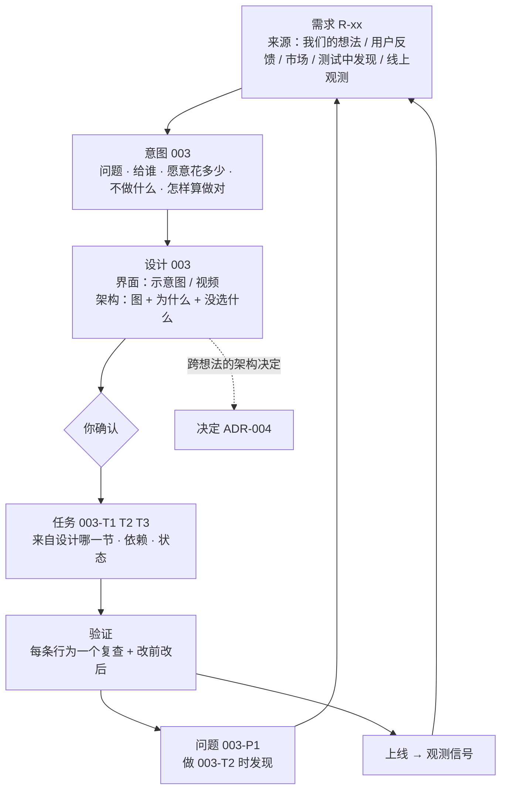

# 项目管理体系：调研与设计（2026-09-28）

起点是一份讲"没有技术背景用 AI 开发产品"的教程（`~/Downloads/AI开发产品教程_完整文稿与图解.md`）。它的核心一句：Agent 可以换，上下文会被压缩，所以项目状态不能只存在聊天记录里；需求、设计、任务、测试、运行状态都要结构化地留下来，让每一轮 Agent 都能重新接住项目。

这份文档回答三件事：专业小团队和 Agent 工具实际怎么安排；yishuship 该怎么安排；每一处为什么这样安排。

## 一、调研：它们共同在做什么

| 来源 | 它留下什么 | 对我们有用的那一条 |
|---|---|---|
| 教程本身 | AGENT.md（项目长期规则）、intent.md、spec.md、tasks、test/logs | 分两层：项目长期的东西和这一次迭代的东西；人只在"把模糊需求变清楚"和"判断设计合不合理"两处必须在场 |
| GitHub spec-kit | constitution.md → spec.md → plan.md（+ research、data-model、contracts）→ tasks.md，每个功能一个编号文件夹（001、002…） | "每个技术选择都有写下来的理由，每个架构决定都能追到具体需求"；不清楚的地方标 `[NEEDS CLARIFICATION]`，不许猜；任务标出能并行的 `[P]` |
| Kiro | requirements.md（或 bugfix.md）→ design.md → tasks.md | 任务链接回需求和设计；按依赖把任务排成可以同时做的几波；bug 单独一种文件：现在怎样 / 应该怎样 / 哪些不能变 |
| Shape Up（Basecamp） | 提案：问题、愿意花多少、方案、坑、明确不做 | 问题和方案必须一起出现，否则方案"飘着"，只能凭设计好坏争论；做的时候按"能独立做完的一整块"（scope）组织，而不是按人按工种分任务 |
| Linear | 需求和客户反馈直接挂在任务上 | 反馈不是另开一个表：每条反馈链接到它促成的任务或项目，于是能按"多少人要这个"来排优先级 |
| 机会方案树（Teresa Torres） | 目标 → 机会（用户的真实需要）→ 方案 → 假设检验 | 需要从真实用户那里来；"凭自己脑子想出来的机会带着偏见"；树形结构让每个方案都能说出它服务哪个需要、哪个目标 |
| Google 设计文档 | 背景和范围、目标和非目标、设计、考虑过的其他方案、跨领域问题（安全、隐私、可观测） | 设计文档是"写下取舍的地方"；方案不明显时才写，明显时不写 |
| 架构决策记录（ADR） | 每个决定一份：背景、决定、后果、状态 | 一份一个决定、编号、不修改，被新决定取代时标"已取代"；留下的是"为什么"，不只是"是什么" |
| Anthropic：长时间运行的 Agent | 功能清单（JSON，每项带 `passes`）、进度日志、git | Agent 会过早宣布完成；一次只做一个功能；只有端到端验证过才把 `passes` 改成 true；用 JSON 因为模型不容易乱改它 |

它们共同的做法有五条：

1. **每一样东西都有编号，下游写明上游是谁。** spec-kit、Kiro、Linear 都这样做，靠编号连起来，而不是靠放在同一个文件里。
2. **来源、意图、设计、任务分开存。** 它们变化的速度不同：意图定了就少动，设计每次评审会改，任务每天在动。放在一起，常动的部分会把定下的部分一起搅乱。
3. **设计必须写"为什么"和"没选什么"。** Google 和 ADR 都把这当成设计文档存在的理由。
4. **任务按"能独立做完、能给人看的一块"来切**（Shape Up 的 scope），并写明依赖。
5. **完成要有可重跑的验证**（Anthropic 的 `passes`、Kiro 的"需求直接变成测试"）；做的过程中发现的问题，要回到需求那一层重新排。

## 二、方案

### 链条



### 文件

```
.ship/
  PROJECT.md          项目是什么、现在能做什么、链条总览（脚本生成下半）
  需求.md             所有进来的需求，一条一行，带来源和去向（进了哪个意图，或没进、为什么）
  决定/               跨想法的架构决定，一份一个：ADR-001-存储用-json.md
  003-截止排序/
    意图.md            来自：R-012、R-015
    设计.md            服务：意图 003；界面图、架构图、没选什么；你确认了 日期
    任务.md            003-T1 来自：设计 §1 · 依赖：无 · 状态
    验证.md            每条行为：怎么验、复查命令、结果、改前改后
    问题.md            003-P1 发现于 003-T2 → 已转 R-020
    证据/
```

### 每一处为什么这样安排

- **需求单独一个清单，不写进意图里。** 需求和意图是多对一的：三个人抱怨同一件事，是三条需求、一个意图；也有需求最后不做。把来源写进意图，就看不到没被采纳的需求，也数不出"多少人要这个"（Linear 就靠这个数来排优先级）。每条需求都标来源类型，你一眼能看出现在做的事里，有多少来自真实用户、有多少来自我们自己的想法（机会方案树提醒的那种偏见）。
- **意图按 Shape Up 的提案写**：问题、给谁、愿意花多少、坑、不做什么、怎样算做对、从哪看出来。问题和方案绑在一起，后面就不会凭感觉争论方案好不好。
- **设计把界面和架构放在一起，但都必须有图和"没选什么"。** 你要判断的是"这样做对不对"，只有摆出被放弃的方案，这个判断才有依据（Google 设计文档的核心就是这一节）。设计经你确认前，任务不能开始。
- **跨想法的架构决定单独存成"决定"。** 比如"存储用 JSON 文件"这种决定，会被以后每个想法继承。如果只写在当时那个想法的设计里，下个想法的 Agent 找不到理由，就可能悄悄推翻它。这正是教程说的"技术债，你自己也搞不懂，Agent 也搞不懂"。
- **任务写明来自设计哪一节、依赖谁、状态。** 你能从任何一个任务倒着追到它的设计、意图和需求；依赖决定先后，没有依赖的可以同时做（spec-kit 的 `[P]`、Kiro 的"波次"）。任务按"做完能给你看的一块"来切，不按工种切。
- **验证单独一份。** 每条行为：怎么验、可重跑的复查、这次的结果。只有在真实运行的产品上验过才算过，这是为了防 Anthropic 记录到的"Agent 过早宣布完成"。
- **问题记下是哪个任务发现的，然后回到需求清单**，来源写"测试中发现 003-T2"。链条就在这里闭合：新需求从做事的过程中来，也从上线后的观测里来。
- **编号全项目唯一，文件开头写"来自 / 服务"。** 链接靠编号，不靠文件摆在一起；脚本据此检查断链，并画出链条。
- **链条由脚本检查，不靠自觉。** 以下情况一律报出来：意图没有来源；设计没写服务哪个意图，或者还没被确认；任务说不出来自设计哪一节；问题说不出是哪个任务发现的；任务标了做完，但验证里没有对应结果。

### 比"每个想法一个文件夹、四个文件"多了什么

1. 需求清单提到项目层，因为来源和意图是多对一的，而且没做的需求也要看得见。
2. 决定提到项目层，因为架构决定会跨想法继承。
3. 验证从任务里拆出来，因为"做完"和"验过"是两件事，必须分开写。
4. 问题回流到需求清单，链条才闭合。

### 明确不采用的

- **用户故事格式**（"作为…我想要…以便…"）不用。Linear 认为它绕远路、把要做的事藏起来了；我们写"用户做什么 → 看到什么"。
- **完整的需求追踪矩阵**（大公司、合规场景那种）不做。编号加脚本检查就能达到同样的追溯效果，成本低得多。
- **机械地为每个想法写设计文档**不做。改动明显、只有一种合理做法时，设计一句话即可（Google 的原则：方案不明显才写）。
